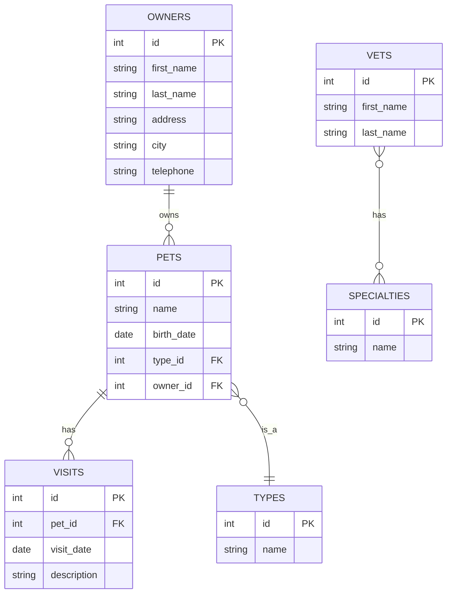

# Spring Petclinic Kotlin — Project Description

## 1. Project Overview and Purpose

**Spring Petclinic Kotlin** is a Kotlin-language implementation of the canonical [Spring Petclinic](https://github.com/spring-projects/spring-petclinic) sample application. It serves as a reference project for demonstrating how to build a full-stack web application using **Kotlin** and **Spring Boot**.

The application is a simplified veterinary clinic management system that allows users to:
- Search, create, and update **pet owners**
- Manage **pets** (add, edit, assign pet types)
- Record **vet visits** for each pet
- Browse a list of **veterinarians** and their **specialties**

This project is maintained under the [spring-petclinic](https://github.com/spring-petclinic) GitHub organization and is one of several technology-stack forks of the original Spring Petclinic application.

---

## 2. Technology Stack

| Category | Technology |
|---|---|
| **Language** | Kotlin 2.3.20 |
| **Framework** | Spring Boot 4.0.4 (Spring Framework 6) |
| **Build Tool** | Gradle 8+ with Kotlin DSL (`build.gradle.kts`) |
| **JVM Target** | Java 17 |
| **Web Layer** | Spring MVC + Thymeleaf templates |
| **UI Framework** | Bootstrap 5.3.8, Font Awesome 4.7.0, LESS stylesheets |
| **Persistence** | Spring Data JPA + Hibernate |
| **Databases** | H2 (in-memory, default) and MySQL (optional) |
| **Caching** | JCache (JSR-107) API with Spring `@EnableCaching` |
| **Validation** | Jakarta Bean Validation (Hibernate Validator) |
| **Testing** | JUnit 5, Mockito, AssertJ, Spring Boot Test (WebMvcTest, DataJpaTest) |
| **Load Testing** | Apache JMeter (`petclinic_test_plan.jmx`) |
| **Containerization** | Docker (Dockerfile + Google Jib plugin) |
| **Dev Tools** | Spring Boot DevTools (development-only) |
| **Actuator** | Spring Boot Actuator (all endpoints exposed) |

---

## 3. Architecture Overview

The application follows a classic **layered architecture** with a clear separation of concerns:

```
┌─────────────────────────────────────────────────────┐
│                  Presentation Layer                  │
│   ┌─────────────┐  ┌────────────┐  ┌──────────────┐ │
│   │ Controllers │  │ Thymeleaf  │  │ Static Assets│ │
│   │  (@Controller)│  │ Templates  │  │  (CSS, fonts)│ │
│   └──────┬──────┘  └────────────┘  └──────────────┘ │
│          │                                            │
├──────────┼────────────────────────────────────────────┤
│          ▼                                            │
│                  Business / Model Layer                │
│   ┌─────────────┐  ┌────────────┐  ┌──────────────┐ │
│   │  Entities   │  │ Validators │  │  Formatters  │ │
│   │  (@Entity)  │  │            │  │              │ │
│   └──────┬──────┘  └────────────┘  └──────────────┘ │
│          │                                            │
├──────────┼────────────────────────────────────────────┤
│          ▼                                            │
│                  Data Access Layer                     │
│   ┌──────────────────────────────────────────────┐   │
│   │         Repositories (Spring Data JPA)        │   │
│   │   (interface extends org.springframework.     │   │
│   │    data.repository.Repository)                │   │
│   └──────────────────────┬───────────────────────┘   │
│                          │                            │
├──────────────────────────┼────────────────────────────┤
│                          ▼                            │
│                  Database Layer                        │
│   ┌──────────────────────────────────────────────┐   │
│   │   H2 (default)  │  MySQL (profile-based)     │   │
│   └──────────────────────────────────────────────┘   │
└─────────────────────────────────────────────────────┘
```

### Key Architectural Decisions

- **`proxyBeanMethods = false`** on `@SpringBootApplication` and `@Configuration` for improved startup performance (proxy-free `@Configuration` mode)
- **Constructor injection** via Kotlin's primary constructor syntax (no `@Autowired` needed)
- **Kotlin-specific compiler flag** `-Xjsr305=strict` for strict nullability handling with Jakarta annotations
- **Deferred JPA repository bootstrap** (`spring.data.jpa.repositories.bootstrap-mode=deferred`) for parallel startup
- **Open-in-view disabled** (`spring.jpa.open-in-view=false`) to avoid the anti-pattern of lazy-loading in views

---

## 4. Key Modules and Their Responsibilities

### 4.1 Model (`org.springframework.samples.petclinic.model`)

Base entity classes shared across the application:

| File | Responsibility |
|---|---|
| `BaseEntity.kt` | Abstract base with `@Id`, auto-generated identity, and `isNew` property |
| `NamedEntity.kt` | Extends `BaseEntity` with a `name` property (used by `PetType`, `Specialty`) |
| `Person.kt` | Extends `BaseEntity` with `firstName` and `lastName` (used by `Owner`, `Vet`) |

### 4.2 Owner Module (`org.springframework.samples.petclinic.owner`)

Manages pet owners, their pets, and pet types:

| File | Responsibility |
|---|---|
| `Owner.kt` | JPA entity; owns a `Set<Pet>`; has address, city, telephone |
| `Pet.kt` | JPA entity; belongs to an `Owner`; has a `PetType`, `birthDate`, and `Set<Visit>` |
| `PetType.kt` | JPA entity extending `NamedEntity` (e.g., "cat", "dog") |
| `OwnerRepository.kt` | Spring Data JPA repository with custom JPQL queries |
| `PetRepository.kt` | Spring Data JPA repository for `Pet` and `PetType` |
| `OwnerController.kt` | CRUD for owners; find-by-last-name workflow |
| `PetController.kt` | CRUD for pets within an owner context |
| `VisitController.kt` | CRUD for vet visits within a pet context |
| `PetValidator.kt` | Custom Spring `Validator` for pet form validation |
| `PetTypeFormatter.kt` | Spring `Formatter<PetType>` for form binding |

### 4.3 Vet Module (`org.springframework.samples.petclinic.vet`)

Manages veterinarians and their specialties:

| File | Responsibility |
|---|---|
| `Vet.kt` | JPA entity; extends `Person`; has many-to-many `Set<Specialty>` |
| `Specialty.kt` | JPA entity extending `NamedEntity` (e.g., "radiology", "surgery") |
| `VetRepository.kt` | Spring Data JPA repository with `@Cacheable("vets")` |
| `VetController.kt` | Displays vet list (HTML and JSON via `@ResponseBody`) |
| `Vets.kt` | DTO wrapper for XML/JSON serialization of vet list |

### 4.4 Visit Module (`org.springframework.samples.petclinic.visit`)

Manages vet visit records:

| File | Responsibility |
|---|---|
| `Visit.kt` | JPA entity; has `date`, `description`, and `petId` |
| `VisitRepository.kt` | Spring Data JPA repository with `findByPetId` query |

### 4.5 System Module (`org.springframework.samples.petclinic.system`)

Cross-cutting concerns and utility controllers:

| File | Responsibility |
|---|---|
| `CacheConfig.kt` | JCache configuration; creates the `vets` cache with statistics enabled |
| `CrashController.kt` | Intentionally throws `RuntimeException` for testing error handling (5xx page) |
| `WelcomeController.kt` | Redirects `/` to the welcome page |

### 4.6 Application Entry Point

| File | Responsibility |
|---|---|
| `PetClinicApplication.kt` | `@SpringBootApplication` class + `main` function using `runApplication<PetClinicApplication>()` |

---

## 5. Database Schema Overview

The application supports two database backends with identical logical schemas.

### Entity-Relationship Diagram



### Tables

| Table | Description |
|---|---|
| `owners` | Pet owner information (name, address, city, telephone) |
| `pets` | Pet records linked to owners and types |
| `types` | Pet type catalog (cat, dog, lizard, snake, bird, hamster) |
| `visits` | Vet visit records with date and description |
| `vets` | Veterinarian information (name) |
| `specialties` | Specialty catalog (radiology, surgery, dentistry) |
| `vet_specialties` | Join table for vet ↔ specialty many-to-many relationship |

### Database Profiles

- **H2 (default)**: In-memory database initialized via `schema.sql` and `data.sql`. H2 console available at `/h2-console`.
- **MySQL**: Activated via `spring.profiles.active=mysql`. Schema and data scripts in `db/mysql/`.

---

## 6. Build and Deployment

### Building the Project

```bash
# Build with Gradle wrapper
./gradlew build

# Run the application
./gradlew bootRun

# Run tests only
./gradlew test
```

### Running with Docker

```bash
# Pre-built image from Docker Hub
docker run -p 8080:8080 springcommunity/spring-petclinic-kotlin

# Build image with Jib
./gradlew jibDockerBuild

# Push to registry
./gradlew jib -Djib.to.auth.username=<user> -Djib.to.auth.password=<pass>
```

### Docker Compose

A `docker-compose.yml` is provided for running with MySQL.

### Application Configuration

| Property File | Purpose |
|---|---|
| `application.properties` | Main configuration (database choice, JPA settings, logging, caching) |
| `application-mysql.properties` | MySQL-specific overrides (datasource URL, credentials) |

### Key Configuration Properties

```properties
database=h2                              # Switch to 'mysql' for MySQL
spring.sql.init.schema-locations=...     # SQL init scripts
spring.jpa.hibernate.ddl-auto=none       # No auto-DDL; scripts manage schema
spring.jpa.open-in-view=false            # Disable OSIV anti-pattern
management.endpoints.web.exposure.include=*  # All actuator endpoints
```

---

## 7. Testing Approach

### Test Categories

| Category | Framework | Location |
|---|---|---|
| **Integration Tests** | `@SpringBootTest` + JUnit 5 | `PetclinicIntegrationTests.kt` |
| **Controller tests** | `@WebMvcTest` + MockMvc | `*ControllerTest.kt` files |
| **Repository tests** | `@DataJpaTest` | `*RepositoryTest.kt` files |
| **Unit tests** | JUnit 5 + AssertJ | `VetTest.kt`, `PetTypeFormatterTest.kt`, `ValidatorTests.kt` |
| **Load tests** | Apache JMeter | `petclinic_test_plan.jmx` |

### Test Configuration

- **Test profile**: `application-test.properties` for test-specific overrides
- **MockMvc Validation Configuration**: `MockMvcValidationConfiguration.kt` for validation testing setup

### Test Coverage Summary

| Module | Controller Test | Repository Test |
|---|---|---|
| Owner | `OwnerControllerTest.kt` | `OwnerRepositoryTest.kt` |
| Pet | `PetControllerTest.kt` | `PetRepositoryTest.kt` |
| Visit | `VisitControllerTest.kt` | `VisitRepositoryTest.kt` |
| Vet | `VetControllerTest.kt` | `VetRepositoryTest.kt` |
| System | `CrashControllerTest.kt` | — |

---

## 8. URL Endpoints Reference

| HTTP Method | URL | Description |
|---|---|---|
| `GET` | `/` | Welcome page |
| `GET` | `/owners/find` | Find owners by last name |
| `GET` | `/owners` | List owners matching last name query |
| `GET` | `/owners/new` | New owner form |
| `POST` | `/owners/new` | Create owner |
| `GET` | `/owners/{ownerId}` | Owner details (with pets and visits) |
| `GET` | `/owners/{ownerId}/edit` | Edit owner form |
| `POST` | `/owners/{ownerId}/edit` | Update owner |
| `GET` | `/owners/{ownerId}/pets/new` | New pet form |
| `POST` | `/owners/{ownerId}/pets/new` | Create pet |
| `GET` | `/owners/{ownerId}/pets/{petId}/edit` | Edit pet form |
| `POST` | `/owners/{ownerId}/pets/{petId}/edit` | Update pet |
| `GET` | `/owners/{ownerId}/pets/{petId}/visits/new` | New visit form |
| `POST` | `/owners/{ownerId}/pets/{petId}/visits/new` | Create visit |
| `GET` | `/vets.html` | Vet list (HTML) |
| `GET` | `/vets` | Vet list (JSON) |
| `GET` | `/oups` | Trigger exception (error page demo) |
| `GET` | `/h2-console` | H2 database console (dev only) |
| `GET` | `/actuator/*` | Spring Boot Actuator endpoints |

---

## 9. Project Structure Summary

```
spring-petclinic-kotlin/
├── build.gradle.kts              # Gradle build configuration (Kotlin DSL)
├── settings.gradle.kts           # Project settings
├── Dockerfile                    # Multi-stage Docker build
├── docker-compose.yml            # MySQL container orchestration
├── src/
│   ├── main/
│   │   ├── kotlin/org/springframework/samples/petclinic/
│   │   │   ├── PetClinicApplication.kt   # Entry point
│   │   │   ├── model/                    # Base entities
│   │   │   ├── owner/                    # Owner, Pet, PetType + controllers/repos
│   │   │   ├── vet/                      # Vet, Specialty + controllers/repos
│   │   │   ├── visit/                    # Visit entity + repository
│   │   │   └── system/                   # Cache, error, welcome controllers
│   │   ├── resources/
│   │   │   ├── application.properties    # Main configuration
│   │   │   ├── application-mysql.properties
│   │   │   ├── db/h2/                    # H2 schema + data scripts
│   │   │   ├── db/mysql/                 # MySQL schema + data scripts
│   │   │   ├── messages/                 # i18n (en, de)
│   │   │   ├── static/                   # CSS, fonts, images
│   │   │   └── templates/                # Thymeleaf HTML templates
│   │   ├── less/                         # LESS stylesheets
│   │   └── wro/                          # WRO4J configuration
│   └── test/
│       ├── kotlin/                       # Kotlin unit + integration tests
│       ├── jmeter/                       # JMeter load test plan
│       └── resources/                    # Test configuration
```
